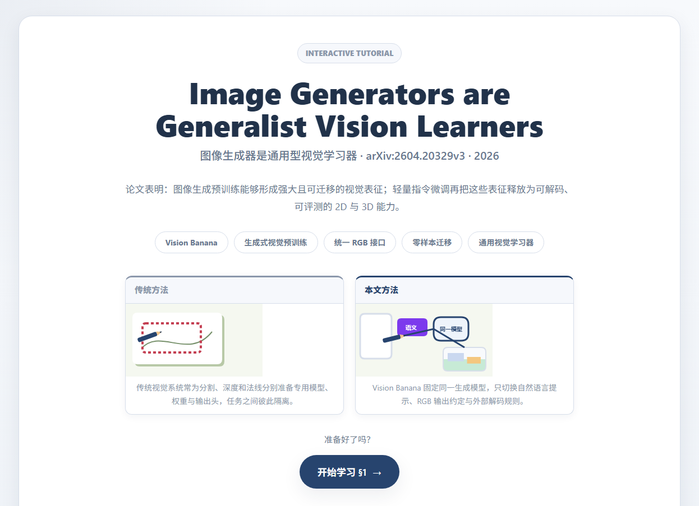
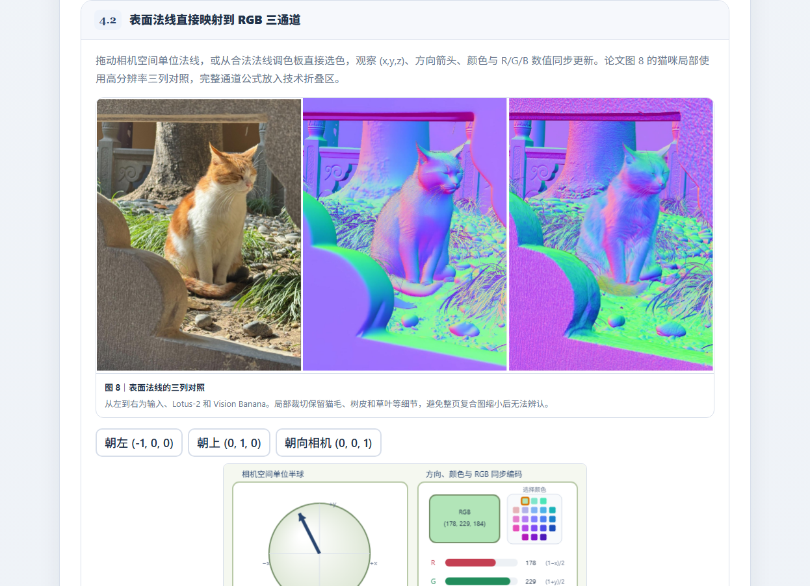

# 图像生成器是通用型视觉学习器 交互式教程

基于论文 *Image Generators are Generalist Vision Learners*，由 **paper-skill** 生成的完整 React + TypeScript + Vite 网页项目。

## 页面预览





## 本地运行

```bash
npm install
npm run dev       # 开发预览 http://localhost:5173
npm run build     # 产出 dist/ 静态站点
npm run preview   # 预览构建结果
```

最终提交应保留整个项目目录，不要只复制 `index.html` 或 `dist/`。

## 目录结构

| 路径 | 说明 | 是否生成器（Agent）修改 |
| ---- | ---- | ---- |
| `src/data/tutorial.ts` | 论文专属内容（章节、模块、公式、B 站、元信息） | ✅ 唯一数据文件 |
| `src/styles/paper.css` | 论文专属 `:root` 配色覆盖 | ✅ 仅此 CSS |
| `src/modules/*.tsx` + `registry.tsx` | 论文专属 Canvas 交互组件 | ✅ 在 registry 注册 |
| `public/images/*` | 论文原图（可选） | ✅ 仅放图 |
| `src/components/*` | 静态展示组件（Hero/Chapter/Module…） | ❌ 模板框架默认 |
| `src/lib/*` | 静态工具（canvasKit / 渐进加载 / B 站） | ❌ 模板框架默认 |
| `src/styles/{tokens,components}.css` | 静态设计令牌与组件样式 | ❌ 模板框架默认 |

## 配色语义（contract.md §5，保持稳定）

- `--blue` 指导/当前状态，`--green` 成功/本文方法，`--red` 失败/传统方法
- `--orange` 用户强调，`--purple` 辅助机制

切勿把 `--accent` 重新定义成别的语义角色。

## 素材来源

- `public/images/figure-*.png` 与 `public/images/paper-*.png` 均来自论文 *Image Generators are Generalist Vision Learners* 的原始图表或其局部裁切，用于非商业的论文学习与课堂展示。论文链接：https://arxiv.org/abs/2604.20329
- `public/images/tutorial-preview-*.png` 为本项目在本地浏览器中的实际渲染截图。
- 页面中的流程图、RGB 路径、法线方向图和其他交互示意均由项目代码依据论文方法绘制，不使用额外的第三方图片素材。
- Bilibili 推荐区仅保存视频 `BV` 号，封面和公开元数据由页面运行时从 Bilibili 获取，版权归原作者及平台所有。
