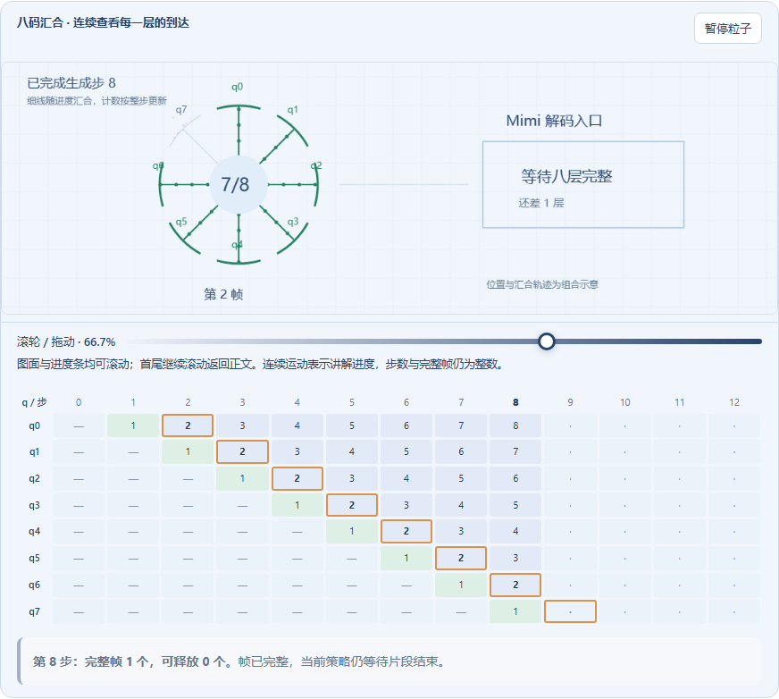
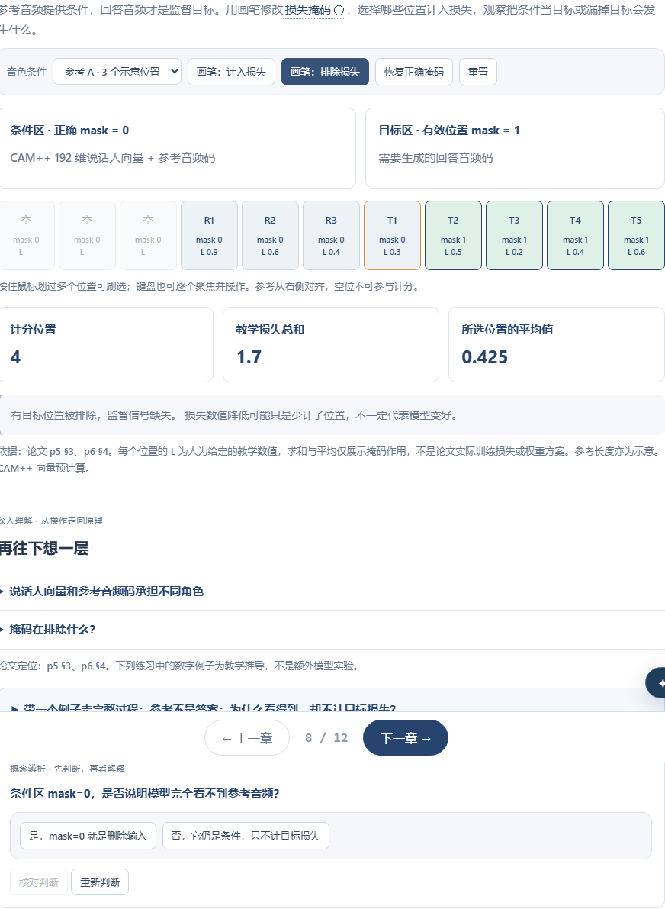
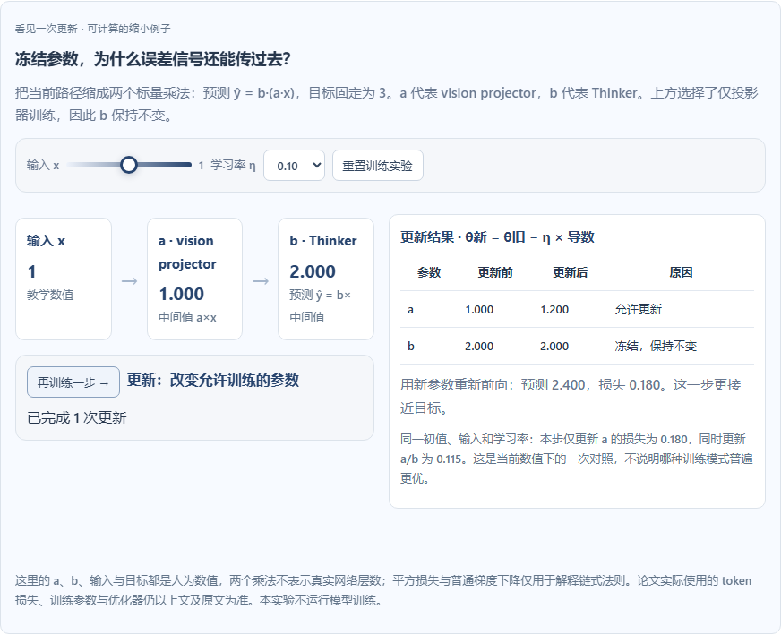

# MiniMind-O：小规模语音原生全模态模型 交互式教程

基于论文 *MiniMind-O Technical Report: An Open Small-Scale Speech-Native Omni Model*，由 **paper-skill** 生成的完整 React + TypeScript + Vite 网页项目。

## 本地运行

```bash
npm install
npm run dev       # 开发预览 http://localhost:5173
npm run build     # 产出 dist/ 静态站点
npm run preview   # 预览构建结果
```

最终提交应保留整个项目目录，不要只复制 `index.html` 或 `dist/`。

## 论文与演示来源

- 事实依据：[arXiv 2605.03937v1](https://arxiv.org/abs/2605.03937v1)，Jingyao Gong，2026。页面页码指 PDF 页码。
- [作者源码](https://github.com/jingyaogong/minimind-o)与[作者在线演示](https://modelscope.cn/studios/gongjy/MiniMind-O)。外链失效不影响教程主体。
- 官方 PaperSkill 1.3.0，版本 `236f1898781161b589c9f793c78ef2014ed3ec96`；实际执行来源缓存、论文专属中间规范、官方脚手架、章节包组装及验证流程。
- 贡献者：尹灿宇（GitHub：maassprelaz-coder）。

## 教学范围与素材

十章依次讲解多模态输入、特征序列、Thinker–Talker、中间层桥接、Mimi 八层码本、延迟排列、音色条件、低秩适配、训练任务及实验边界。

所有机制图和示例码值均为本教程生成的教学示意；没有复制论文插图。动画步数和时长不表示真实推理延迟。真实实验数值来自论文图 8(f) 及表 2–5，不推算不存在的配置。约 0.1B 的主模型口径不包含冻结的外部组件；CER/WER 不代表音质评分。

核心教程在浏览器运行，不下载 MiniMind-O 模型权重或训练数据。B 站条目及作者模型演示为外部链接。新增的可选论文 AI 助教通过本机 Node 服务调用 DeepSeek；公开源码不包含密钥。

## 选中文字问 AI（可选本地功能）

正文选中至少两个字，点击“问尹灿宇 · AI”，再发送问题；也可使用右下角同名入口。支持快捷提问、追问、停止与清空。助教显示为尹灿宇的 AI 讲解分身，由 DeepSeek 提供回答，区别于本人实时在线与作者 MiniMind-O 演示。发送时包括选文、当前章节摘要、已挂载实验的当前状态、核对资料和最近几轮问答；仅选中文本不会发起 API 调用。AI 回答需对照论文，不作为新增实测证据。

服务要求 Node 20.6+。准备未提交的环境配置文件，参考 `server/.env.example`，然后运行：

```sh
node --env-file=/path/to/private.env.local server/tutor.mjs
npm run dev
```

服务仅监听本机 127.0.0.1:5174；Vite 将 `/api/tutor` 代理到它。默认使用 `deepseek-flash`、关闭思考模式、限制单次输出长度。密钥仅由服务端读取，不使用 `VITE_` 环境变量。问题和回答没有写入服务端日志。

`npm run build` 生成静态教程，不会部署 Node 服务。GitHub Pages 本身不能运行该助教后端；公开版本如要启用问答，需要另行部署服务并配置接口。未连接时页面会明确显示状态，核心教程及真实模型体验入口仍可用。本次完成的是本地接通，未发布公共 API。

## 真实模型体验区

开场页和目录提供体验区入口，包含文字、语音、图片三个任务；模型生成在作者的 ModelScope 页面进行。本站提供提问复制、自制几何图 PNG 下载、当前标签页会话中的观察记录，以及返回机制章节的入口。观察记录不上传服务器。官方页面是否能加载或生成不能由本站持续保证；Gradio 非实时演示不能用于推断论文的流式延迟。

`public/audio/official-rain-test-20260914.wav` 是 2026-09-14 使用作者公开演示实际生成的原始音频，非配音或其他 TTS 替代。测试输入为“请用一句简短的中文回答：下雨出门要带什么？”，模型文字输出为“如果下雨，需要带雨伞。”。文件为 24 kHz、单声道、1.92 秒。未记录具体检查点版本；仅用于体验，不用于复现论文指标。未上传个人录音或照片。

为用户要求的关键词开场页、真实模型体验入口及滚轮阅读，`src/App.tsx` 有局部导航扩展；其余基础章节框架仍沿用官方模板。自动结构验证通过不等于完全没有框架扩展。

## 电脑端滚轮阅读与探索实验

- 第三、六章图案区域：图面和进度条都支持鼠标滚轮向下连续推进、向上连续回看，也支持拖动和节点定位。可以停在两个讲解节点之间；模型步骤和完整帧计数仍是整数。达到图解首尾后，再继续滚动会回到正文阅读。进度条以外的输入控件、按钮和缩放手势保留原操作。减少动画设置下，连续进度直接跟随输入。
- 第一至九章：读到页面最底部，继续向下滚动自动进入下一章，从章首开始。第十章不会自动跳到延伸视频。目录、嵌套滚动区域与打开的 AI 对话不会触发自动切章，并设有短暂间隔避免连续误跳。
- 第二、四、七章：拖放特征到兼容序列区域，拖动桥接点到合法层位置，刷选条件/目标上的损失掩码；均保留键盘操作。第五章悬停仅预览，点击固定观察，可移除和补回码本层检查完整性。
- 重要术语：悬停或聚焦查看短定义，点击在正文中固定说明，再次点击或按 Esc 收起。
- 第八章矩阵实验：切换目标结构、调整保留方向数，比较 4×4 目标矩阵与低秩重建；点击格子查看对应乘加。显示的是基础代数重建误差和因子存储成本，不是论文训练结果。
- 第九章训练实验：随当前任务和训练模式切换，用两个标量乘法解释前向、误差、链式法则和参数更新。左侧流程和右侧结果保持在固定工作区；可改变输入、学习率并继续训练；这里使用教学平方损失与普通梯度下降，不是 MiniMind-O 训练。
- 第十章字符实验：点击论文图中的条形查看相应的指标口径与来源；编辑参考与假设转录，按最少编辑距离计算 CER，点击对齐位置查看错误原因。支持标点预处理、空参考提示与 CER 超过 100% 的情况；不调用 ASR 或外部服务。

这些功能均在浏览器内运行。论文真实 loss、CER 与参数表仍独立保留，不将教学结果冒充实测。

## 关键交互截图

以下截图来自本作品实际运行，分别展示连续时间游标与完整帧、可刷选损失掩码，以及冻结参数的教学数值实验。截图中的数值实验不代表模型实测。







## 目录结构

| 路径 | 说明 | 是否生成器（Agent）修改 |
| ---- | ---- | ---- |
| `src/data/tutorial.ts` | 论文专属内容（章节、模块、公式、B 站、元信息） | ✅ 唯一数据文件 |
| `src/styles/paper.css` | 论文专属 `:root` 配色覆盖 | ✅ 仅此 CSS |
| `src/modules/*.tsx` + `registry.tsx` | 论文专属 Canvas 交互组件 | ✅ 在 registry 注册 |
| `public/images/*` | 论文原图（可选） | ✅ 仅放图 |
| `src/components/*` | 静态展示组件（Hero/Chapter/Module…） | ❌ 模板框架默认 |
| `src/lib/*` | 静态工具（canvasKit / B 站） | ❌ 模板框架默认 |
| `src/styles/{tokens,components}.css` | 静态设计令牌与组件样式 | ❌ 模板框架默认 |

## 配色语义（contract.md §5，保持稳定）

- `--blue` 指导/当前状态，`--green` 成功/本文方法，`--red` 失败/传统方法
- `--orange` 用户强调，`--purple` 辅助机制

切勿把 `--accent` 重新定义成别的语义角色。
