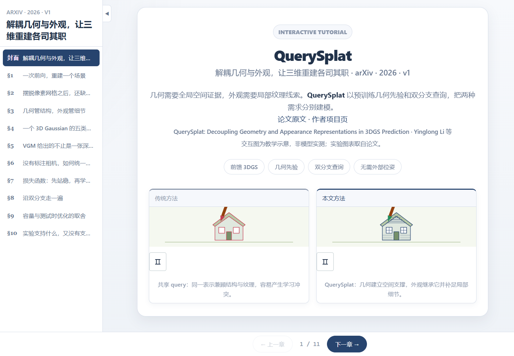

# 验证记录

日期：2026-09-15。

## 自动检查

- PaperSkill 输出结构校验通过：10 章、13 个主动交互模块、3 个双模块章节、所有内容组件已注册，无模板占位符。
- `npm install` 成功；安装时审计结果为 0 个已知漏洞。
- `npm run build` 成功：TypeScript 编译和 Vite 生产打包通过。
- Playwright + 本机 Edge 无头浏览器：1440 × 1000 与 390 × 844。
- 两种尺寸下逐页检查封面及 10 章：无页面横向溢出、无 JavaScript 运行错误；所有 Canvas 滚动进入视口后非空白。
- 动画像素随时间变化；暂停后保持不变。

## 交互验证

两种尺寸下均通过以下检查：

1. 前馈/逐场景模式切换，以及分步演示的起点和终点边界。
2. 三种表示方法切换后产生不同反馈。
3. 几何、外观图层分别开关；均关闭和外观单独显示的依赖说明。
4. 属性分类、拖动位置、方向键调节滑块；调节时不误触章节导航。
5. VGM 三类信息切换。
6. 双次前向与 Sim(3) 四阶段切换。
7. 20K、100K 后的损失状态和 Chamfer 说明。
8. Opacity 下限：α = 1 时惩罚为 0；α = 0.01 时单项惩罚为 2.3026。
9. 原图加载尺寸及 CC BY-SA 4.0 图注。
10. 8,192 queries 对应 524,288 个 Gaussian。
11. 300 视图效率条目显示论文报告的 255.725 秒。
12. 12 视图 LPIPS 最佳前馈方法为 YoNoSplat (posed)，0.1958；显示 TTO 后不改变前馈排名；未报告项仍为空值。
13. 主干消融：PSNR 最优为 VGGT，LPIPS 最优为 VGGT-Ω。

## 人工确认状态

使用者已在导入前明确回复“已核验并确认”，认可当前网页的事实、公式与实验数据；在最终构建完成后明确回复“预览已确认，可以提交”，确认桌面及手机网页显示、资源与主要交互正常。自动检查不代替人工判断；没有训练或运行 QuerySplat，没有复现实验，也没有验证实际 GPU 性能。

## 辅助截图

截图是本教程的浏览器渲染记录，不是论文实测重建结果，不能替代使用者预览确认。

