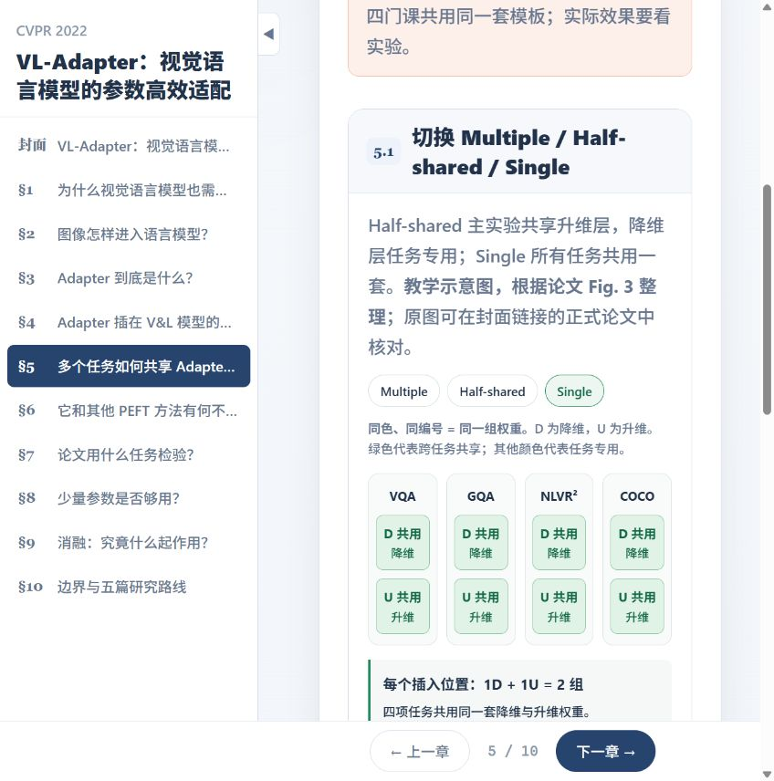
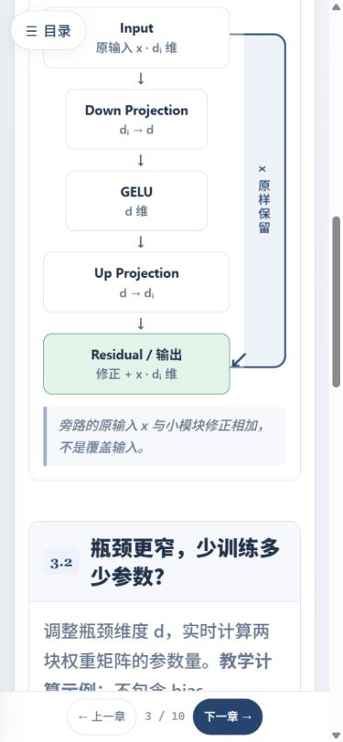

# VL-Adapter 中文交互式教程

基于 PaperSkill 制作的 React + TypeScript + Vite 教学网页，围绕视觉语言任务中的参数高效适配展开，包含 10 个章节与 15 个教学模块。

## 论文来源

- Yi-Lin Sung, Jaemin Cho, Mohit Bansal. *VL-Adapter: Parameter-Efficient Transfer Learning for Vision-and-Language Tasks*. CVPR 2022, pp. 5227–5237.
- [正式论文与补充材料](https://openaccess.thecvf.com/content/CVPR2022/html/Sung_VL-Adapter_Parameter-Efficient_Transfer_Learning_for_Vision-and-Language_Tasks_CVPR_2022_paper.html)
- [作者代码](https://github.com/ylsung/VL_adapter)

实验记录以 CVPR 正式版为准。网页中的参数量计算和结构示意用于教学，实验分数标明对应原表及比较条件。Avg. 混合 Accuracy 与 CIDEr，不能解释为平均准确率。

## 安装与运行

```bash
npm ci
npm run dev
npm run build
npm run preview
```

本项目使用相对资源路径，可部署于 GitHub Pages 子目录。提交完整源码，部署服务根据源码生成网页。

## 项目结构与素材

- `src/data/tutorial.ts`：章节、公式和论文记录。
- `src/modules/`：结构、参数计算及实验对照交互。
- `src/components/`、`src/lib/`、`src/styles/`：页面组件、绘图工具和样式。
- `public/images/`：包含供 PR 审核使用的本教程页面截图。当前提交副本不包含论文裁图；结构图由网页绘制，原图可通过论文链接核对。

本版本已通过 PaperSkill 官方导入工具生成 `paper.json`，提交者为 Jing Yuxi（GitHub：commoncreate），版本为 `jingyuxi1005`，日期为 2026-10-05。元数据状态为 `review`，等待 PaperSkill 维护者审核。

工作笔记、论文 PDF、依赖目录和构建产物不属于源码提交内容。

## 审核预览

执行上面的安装、构建和预览命令后，检查第 3 章的 Adapter 残差结构、瓶颈参数计算，以及第 5 章的任务共享切换。以下图片是贡献者对本教程运行页面的截图，不是论文原图；仅作为审核辅助，不能替代实际操作网页。




